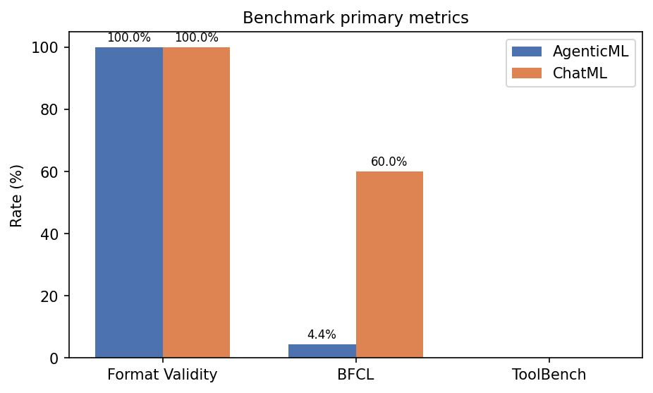
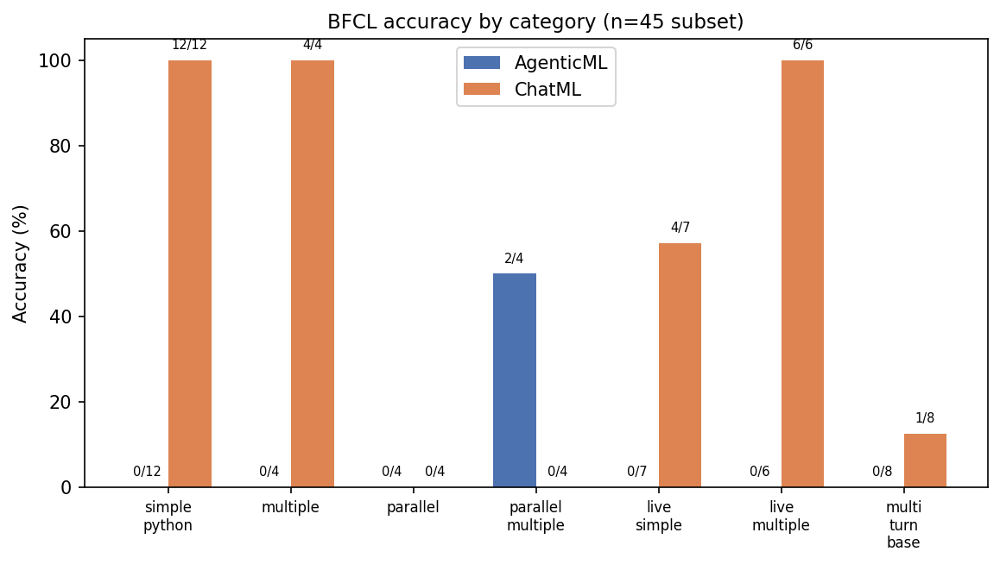
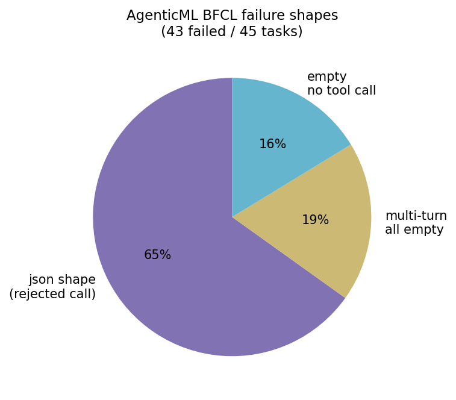
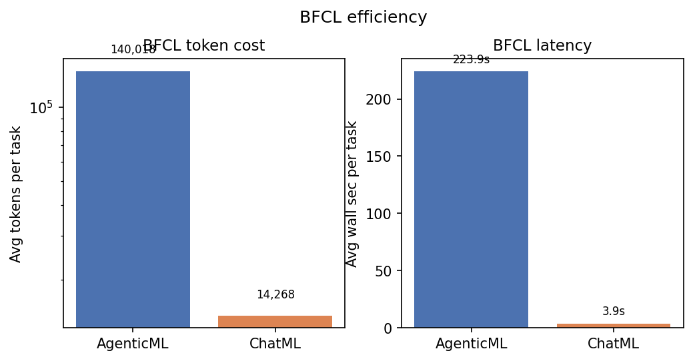

# AgenticML vs ChatML — Evaluation Report (June 2026)

**Working title:** *Same Trajectories, Different Wires: Comparing AgenticML and ChatML for Tool-Use Fine-Tuning*

**Thesis:** Fine-tuning the same agent trajectories into Llama 3.1 8B with two serializations produces dramatically different upstream benchmark scores — even when both formats pass structural validity checks.

**Artifacts:** Merged models and dataset on Hugging Face; raw benchmark tarball `kosiasuzu/agenticml-runpod-benchmarks-jun2026`; aggregate JSON [`results/benchmarks/runpod_jun2026_aggregate.json`](../results/benchmarks/runpod_jun2026_aggregate.json).

Reproduce the pipeline: [`recipe.md`](../recipe.md).

Regenerate the results matrix after syncing new artifacts:

```bash
agenticml eval-aggregate-results --output results/benchmarks/aggregate_table.md
python scripts/generate_eval_figures.py
```

**Models:** `kosiasuzu/agenticml-llama3.1-8b-lora-merged`, `kosiasuzu/chatml-llama3.1-8b-lora-merged`.

---

## 1. Summary

We trained two models on the **same** synthetic agent dataset. One speaks **AgenticML** (typed frames with reserved markers). One speaks **ChatML** with Llama-style function calls. Same LoRA recipe, same merge step, RunPod L40S evaluation.

| | AgenticML | ChatML |
|---|-----------|--------|
| Format Validity (smoke) | **100%** parse / valid | **100%** parse / valid |
| BFCL accuracy (n=45) | **4.4%** (2/45) | **60.0%** (27/45) |
| ToolBench pass (n=10) | **0%** | **0%** |
| SWE-bench | Not run (no Docker) | Not run |



The BFCL gap is not “AgenticML forgot tools.” Most AgenticML failures are **wrong-shaped** outputs (duplicate call arrays on single-call tasks) plus multi-turn collapse. ChatML inherits BFCL’s native prompt surface and wins single-turn categories.

---

## 2. Decisions and Changes Along the Way

Chronological log of choices that shaped this run. Full repro steps live in [`recipe.md`](../recipe.md).

| When | Decision | Rationale |
|------|----------|-----------|
| Training | `chat_template_ids`: render template then encode | Fixed label masking / tokenization mismatch vs raw string concat |
| Training | Dataset cache invalidation after template fix | Stale HF cache silently reused wrong tokenization |
| Training | Hub push via `HF_TOKEN` in env | Bare `hf` not always on PATH on pods |
| Eval install | Staged BFCL: `.[eval]` then editable `bfcl_eval` + `soundfile` | `pip install -e ".[eval-benchmarks]"` fails on relative `file://` BFCL pin |
| ToolBench data | `hf download nullwwg/toolbench-data --repo-type dataset` | Without `--repo-type dataset` HF searches models and 404s |
| ToolBench data | Extract with `python -c "import zipfile; ..."` | RunPod images often lack `unzip` |
| ToolBench bridge | Skip malformed actions with `content=None` under `strict=False` | Upstream traces had null actions that crashed conversion |
| BFCL subset | Pinned **45** cases (was 50); swapped slow multi-turn (67, 88, 97, 154, 24) for faster 2–3 turn cases | Full multi-turn vehicle/travel cases dominated wall time on pod |
| BFCL subset | Exclude irrelevance category | Misaligned with tool-first AgenticML framing |
| Format Validity | Report **100%** from prior smokes; **no n=100 re-run** | Wire-format compliance already established; pod job did not finish n=100 |
| SWE-bench | Skipped on RunPod | No Docker on pod |
| Results sync | Hub dataset tarball instead of `scp` | RunPod SSH proxy breaks `scp`; extract at **repo root** (`tar xzf ... -C .`) |
| Ops | Use `tmux` for long `eval-run-all` | SSH drop killed visibility; process survived on pod |

Optional follow-up (not done): BFCL harness fix — collapse duplicate action frames to a single call on non-parallel categories before grading.

---

## 3. Experimental Setup

| Item | Value |
|------|--------|
| Base | Llama 3.1 8B |
| Data | `kosiasuzu/agenticml-agent-trajectory-dataset` (`frames` / `messages` paired) |
| Init | Reserved-slot embeddings (AgenticML) vs instruct tokenizer rows (ChatML) |
| Training | LoRA r=32, α=64, 2 epochs, cosine LR 2e-4, batch 1 × grad accum 32 |
| Models | [`agenticml-llama3.1-8b-lora-merged`](https://huggingface.co/kosiasuzu/agenticml-llama3.1-8b-lora-merged), [`chatml-llama3.1-8b-lora-merged`](https://huggingface.co/kosiasuzu/chatml-llama3.1-8b-lora-merged) |
| Pod | RunPod `w7ldz9cztwcljf`, NVIDIA L40S |
| Command | `agenticml eval-run-all --suites bfcl toolbench format_validity --continue-on-error` |
| BFCL subset | 45 pinned IDs in `src/agenticml/evaluation/benchmarks/bfcl/subset.py`, seed 42 |
| ToolBench subset | 10 pinned G1_instruction query IDs in `toolbench/subset.py` |

### Research Questions

1. **RQ1 — Format Validity:** Can each format produce parseable, structurally valid agent output? → **Yes** (100% smokes, both formats).
2. **RQ2 — Downstream benchmarks:** Does serialization affect BFCL / ToolBench under matched SFT? → **Yes** (60% vs 4.4% BFCL; both 0% ToolBench).
3. **RQ3 — Efficiency:** Token and latency cost per successful BFCL task? → AgenticML ~10× tokens and ~57× wall time vs ChatML on this subset (see efficiency figure).

---

## 4. Results

### 4.1 Results Matrix (Completed Cells)

RunPod full evaluation (June 2026), L40S.

| Suite | Format | Model | n | Primary | Secondary | Avg Tokens | Tok/Success | Avg Wall Sec |
|-------|--------|-------|---|---------|-----------|------------|-------------|--------------|
| BFCL | AgenticML | agenticml-llama3.1-8b-lora-merged | 45 | 4.4% (accuracy) | 3.9 (avg_retry_count) | 140,018 | 1,363 | 223.9 |
| BFCL | ChatML | chatml-llama3.1-8b-lora-merged | 45 | 60.0% (accuracy) | 1.6 (avg_retry_count) | 14,268 | 3,775 | 3.9 |
| ToolBench | AgenticML | agenticml-llama3.1-8b-lora-merged | 10 | 0.0% (pass_rate) | 1.0 (avg_steps) | 2,121 | — | 29.7 |
| ToolBench | ChatML | chatml-llama3.1-8b-lora-merged | 10 | 0.0% (pass_rate) | 9.8 (avg_steps) | 21,542 | — | 11.4 |
| Format Validity | AgenticML | agenticml-llama3.1-8b-lora-merged | smoke | **100%** (valid_rate) | **100%** (parse_rate) | — | — | — |
| Format Validity | ChatML | chatml-llama3.1-8b-lora-merged | smoke | **100%** (valid_rate) | **100%** (parse_rate) | — | — | — |

JSON: [`results/benchmarks/runpod_jun2026_aggregate.json`](../results/benchmarks/runpod_jun2026_aggregate.json). Raw summaries: Hub dataset `kosiasuzu/agenticml-runpod-benchmarks-jun2026`.

Format Validity rows are from prior validation smokes (both formats 100% parse/valid). No n=100 re-run planned — wire-format compliance is already established.

#### Not in This Run

| Cell | Status |
|------|--------|
| SWE-bench × both | Skipped on pod (no Docker) |

#### Per-Suite Metrics

| Suite | Primary | Secondary |
|-------|---------|-----------|
| Format Validity | valid_rate | parse_rate |
| BFCL | accuracy | avg_retry_count |
| ToolBench | pass_rate (structural) | avg_steps |
| SWE-bench | resolved_rate | avg_iterations |

Secondary BFCL metrics: avg_retry_count **3.9** (AgenticML) vs **1.6** (ChatML).

### 4.2 BFCL by Category

| Category | AgenticML | ChatML |
|----------|-----------|--------|
| simple_python | 0/12 | **12/12** |
| multiple | 0/4 | **4/4** |
| parallel | 0/4 | 0/4 |
| parallel_multiple | **2/4** | 0/4 |
| live_simple | 0/7 | 4/7 |
| live_multiple | 0/6 | **6/6** |
| multi_turn_base | 0/8 | 1/8 |

Head-to-head on 45 tasks: **27** ChatML-only passes, **16** both fail.



### 4.3 AgenticML Failure Taxonomy (BFCL)

43 failed tasks:

| Shape | Count | Meaning |
|-------|-------|---------|
| json_tool_call | 28 | Model emitted tool JSON; BFCL grader still rejected |
| multi_turn_all_empty | 8 | No usable turn output across multi-turn loop |
| empty_no_tool_call | 7 | Encoded result was `[]` |



**Mechanisms:**

1. **Duplicate parallel arrays on single-call tasks** — e.g. `simple_python_52`, `_57`, `_71`, `_114`. Ground truth expects one `{"name": ..., "parameters": ...}`. Multiple action frames in one step → `actions_to_result` builds a JSON array. ChatML emits a single FC object → 12/12 on simple_python.
2. **Multi-turn collapse (0/8)** — Loop stops when a step returns `[]` or parse error.
3. **Live schema mismatch (0/13 AgenticML vs 10/13 ChatML)** — Live categories need exact dotted tool names; ChatML uses BFCL’s native system prompt; AgenticML uses goal/mission + TypeScript `with_tool_obs`.
4. **Parallel categories** — ChatML often emits one call when several are required; AgenticML sometimes over-calls. `parallel_multiple` 2/4 is the one category where AgenticML beat ChatML.

### 4.4 ToolBench

All 10 tasks completed inference and scoring. Every row failed structurally with **`no finish`** (no terminal finish action within step budget). Infra is fine; models need better multi-step tool use on G1_instruction.

### 4.5 Efficiency



AgenticML BFCL runs averaged **140k tokens** and **224s** wall time per task vs ChatML **14k tokens** and **3.9s** — largely driven by retry loops and multi-turn empties, not raw inference speed alone.

---

## 5. Discussion

**Prompt alignment vs BFCL:** ChatML eval uses BFCL’s native ChatML + function-call path. AgenticML uses our frame runtime and bridge into gorilla result JSON. That asymmetry is intentional (each format evaluated in its natural harness) but it explains much of the live-category gap.

**Eval fairness:** Treating AgenticML 4.4% as pure capability understates the format. A harness fix (single-call collapse for non-parallel categories) is the highest-leverage ablation before retraining.

**When AgenticML may still help:** Trajectory clarity, custom runtimes, SWE-style long horizons, domains where ChatML FC is not the target wire format.

**Limitations:** 8B only; synthetic data; Format Validity not at n=100 on RunPod; SWE-bench skipped; no harness-fix ablation yet; ToolBench 0% both formats.

---

